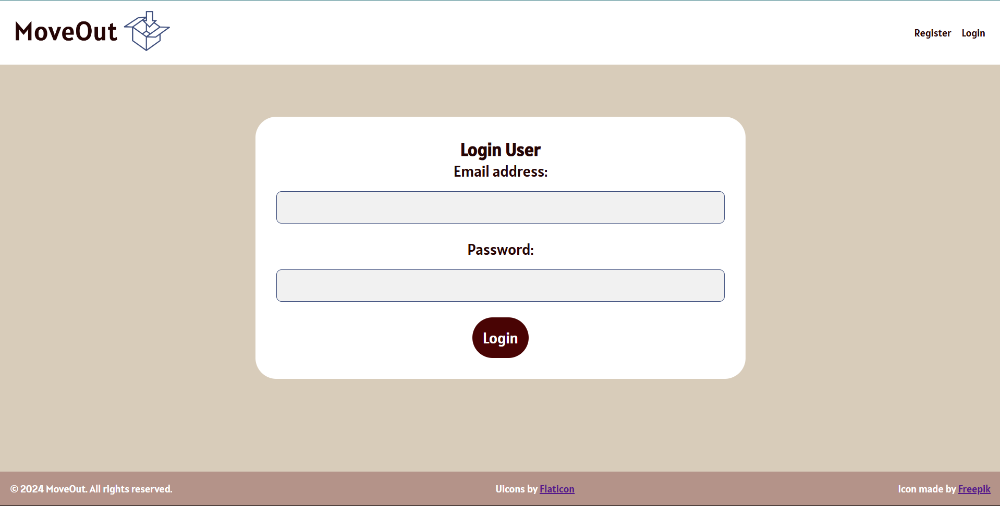

# MoveOut Application

## Introduction

The MoveOut Application is a web-based tool designed to streamline the organization of house moves. It allows users to create labels with QR codes for boxes, which can store detailed descriptions (like text, audio, and images) of box contents. By scanning a QR code, users can quickly retrieve this information, making it much easier to locate items during a move and keep track of everything without hassle.

**Primary Features:**

- User registration with email verification and secure password storage.
- Three label designs to choose from, each including a unique QR code.
- Support for adding different content types (text lists, audio recordings, images) to labels.
- Option to create public or private labels.
- Scanning a QR code to view content without needing to log in.



## Architecture Overview

The application follows a MERN stack architecture:

- **Frontend**: Built with React.js for a responsive and interactive user interface.
- **Backend**: A Node.js and Express server manages APIs, authentication, and QR code generation.
- **Database**: MongoDB stores user data, label details, and content references.

## How to Use

### Prerequisites

To run and build the MoveOut Application, ensure you have the following dependencies installed:

- Node.js and npm (for both frontend and backend)
- MongoDB (for data storage)

After cloning the repository, navigate to the project directory and install the required dependencies:
```
cd backend
npm install   # Installs backend dependencies
cd ../frontend
npm install   # Installs frontend dependencies
```

### Environment Variables

Create a `.env` file in both the backend and frontend directories to store necessary environment variables. Here’s a sample for the backend:
```
# Backend .env example
MONGO_URI=mongodb://localhost:27017/moveout
JWT_SECRET=your_jwt_secret
```


### Database Setup

1. Ensure MongoDB is running locally or accessible via a URI.
2. If necessary, create the required collections by running:
```
cd backend
npm run setup-db  # Adjust if a setup command/script is required
```

### Build

To build the project, you can simply run the following commands in both the frontend and backend directories:
```
# In the backend directory
npm run build

# In the frontend directory
npm run build
```
This will create production-ready builds for both the server and the client.

### Test

To run tests for both the backend and frontend:
- **Backend Tests**: Place backend tests in the tests directory under backend and use the command below to run them.
```
cd backend
npm test
```
- **Frontend Tests**: Place frontend tests in the `src/tests` directory in frontend and run:
```
cd frontend
npm test
```


### Run

To run the application locally, replace the frontend and backend URLs currently configured for deployment with `http://localhost:3000` for the frontend and `http://localhost:5000` for the backend.

To start the project in development mode:
1. **Start the backend server:**
```
cd backend
npm start
```
2. **Start the frontend server:**
```
cd frontend
npm start
```

- The backend will run on `http://localhost:5000`
- The frontend will run on `http://localhost:3000`

### Deployment

The project is currently deployed on Render:
- **Backend**: https://moveout.onrender.com
- **Frontend**: https://moveoutapp.onrender.com.

To deploy the MoveOut Application on Render, follow these steps:

1. **Set Up a Render Account**
   - Sign up for a Render account if you don’t already have one.
   - You may need to link your GitHub or GitLab account to Render to access your project repository.

2. **Deploy the Backend**
   - Go to your Render dashboard and select **New > Web Service**.
   - Choose the repository containing your backend code.
   - Fill in the required information:
     - Environment: Select Node for a Node.js backend.
     - Build Command: `npm install`
     - Start Command: `npm start` or `node server.js` (depending on your backend entry file).
   - Add environment variables:
     - `MONGO_URI`: MongoDB connection string.
     - `JWT_SECRET`: Your JWT secret key.
   - Click **Create Web Service** to deploy the backend.

3. **Deploy the Frontend**
   - Go back to your Render dashboard and select **New > Static Site**.
   - Choose the repository containing your frontend code.
   - Configure the static site:
     - Build Command: `npm install && npm run build`
     - Publish Directory: `build`
   - Update any environment variables if necessary (e.g., backend API URL pointing to your Render backend URL).
   - Click **Create Static Site** to deploy the frontend.

4. **Update URLs in the Frontend**
   - Ensure that the frontend’s configuration (e.g., `config.js` or `.env`) points to the Render backend URL (e.g., https://moveout.onrender.com).

**OBS!** If using Gmail/Google as the admin's email, create and enter an app password specifically generated for the application.

## License

Copyright © 2024 Linnéa Arildsson

This work is licensed under MIT License.
